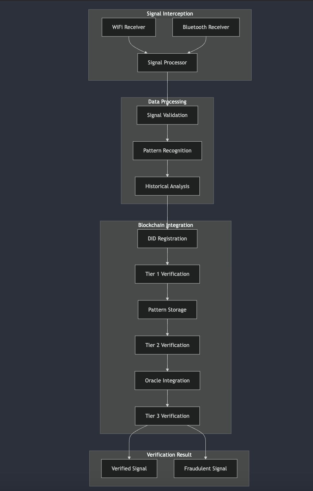

# Drone Signal Verification System
## Technical Architecture & Implementation Guide

### Table of Contents
<!-- 1. [Executive Summary](#executive-summary) -->
1. [System Architecture](#system-architecture)
2. [Verification Process](#verification-process)
3. [Security Considerations](#security-considerations)
4. [Implementation Guidelines](#implementation-guidelines)
5. [Technical Diagrams](#technical-diagrams)

<!-- ### Executive Summary
This document outlines a comprehensive system for verifying drone signals using the peaq blockchain's multi-tiered verification approach. The system is designed to intercept and validate drone RemoteID signals transmitted via WiFi or Bluetooth, ensuring signal authenticity and detecting potential fraudulent activities. -->

### System Architecture

#### Core Components

1. **Signal Interception Layer**
   - WiFi/Bluetooth receivers for drone signal capture
   - Signal preprocessing unit
   - Data standardization module

2. **Data Processing Layer**
   - Real-time signal validation
   - Pattern recognition engine
   - Historical data analysis
   - Signal fingerprinting module

3. **Blockchain Integration Layer**
   - DID registration system
   - Smart contract integration
   - Oracle connectivity
   - Pattern storage & matching

### Verification Process

#### Tier 1: Machine-Origin Authentication
- Signal capture and preprocessing
- RemoteID extraction
- DID creation and registration
- Initial validation checks

#### Tier 2: Pattern Matching
- Historical pattern analysis
- Signal characteristic validation
- Behavioral pattern matching
- Anomaly detection

#### Tier 3: Oracle-Backed Authentication
- External data source validation
- Multi-oracle consensus
- Real-time verification
- Trust score calculation

### Security Considerations

#### Threat Analysis
1. Signal Spoofing
   - Risk: High
   - Impact: Critical
   - Mitigation: Signal fingerprinting, temporal validation

2. Replay Attacks
   - Risk: Medium
   - Impact: High
   - Mitigation: Timestamp validation, sequence checking

3. DID Impersonation
   - Risk: Medium
   - Impact: Critical
   - Mitigation: Multi-factor verification, pattern analysis

#### Security Measures
- Real-time signal validation
- Geographic fence checking
- Temporal window validation
- Multi-point verification
- Pattern-based anomaly detection

### Implementation Guidelines

#### System Requirements
- High-performance signal receivers
- Robust processing capabilities
- Secure blockchain connectivity
- Redundant storage systems

#### Development Stack
- Backend: Node.js
- Blockchain: Peaq Network
- Database: Time-series DB for pattern storage
- APIs: RESTful for oracle integration

### Technical Diagrams

#### System Flow Diagram




#### Component Architecture
1. Signal Interception
   ```
   [WiFi/BT Receivers] → [Signal Processor] → [Data Standardization]
   ```

2. Data Processing
   ```
   [Raw Data] → [Validation] → [Pattern Analysis] → [Trust Score]
   ```

3. Blockchain Integration
   ```
   [DID Creation] → [Registration] → [Verification] → [Oracle Check]
   ```

### Best Practices & Recommendations

1. **Signal Processing**
   - Implement robust error handling
   - Use buffering for burst signals
   - Apply noise reduction algorithms
   - Maintain signal integrity

2. **Pattern Recognition**
   - Use machine learning for pattern analysis
   - Implement adaptive thresholds
   - Regular pattern database updates
   - Real-time anomaly detection

3. **Security Implementation**
   - Regular security audits
   - Penetration testing
   - Incident response planning
   - Continuous monitoring

### Conclusion
This architecture provides a robust framework for drone signal verification while addressing key security concerns. The multi-tiered approach ensures comprehensive validation while maintaining system flexibility and scalability.

### Appendix
- API Documentation
- Error Code Reference
- Security Protocol Details
- Performance Metrics
